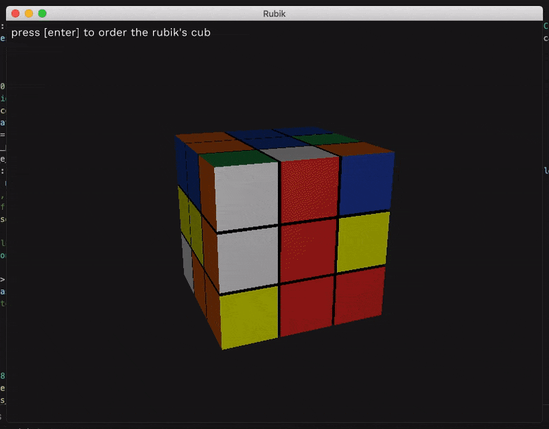

# rubik (work in progress)
A Rubik's Cube solver, written in Rust<br/>
This is a 42 school project <strong>[Final grade: work in progress]</strong>

---
## Demo

Online demo : [Rubik's online](https://rubik.nicolasvienot.co/)



---
## Setup
If you do not have Rust
```
> curl --proto '=https' --tlsv1.2 -sSf https://sh.rustup.rs | sh
> export PATH=$PATH:$HOME/.cargo/bin
```
Then you can build the project
```
> cargo build --release
```
To setup the server with docker, you can launch:
```
> docker-compose up
```
You can then access `localhost:8080`


---
## Usage
```
> ./target/release/solve [FLAGS] [OPTIONS] <input_sequence>
```

### Flags
```
-h, --help            Prints help information
-V, --version         Prints version information
-v, --visualisator    enable the visualisator
```

### Options
```
-s, --speed <speed_selection>    visualisator speed selection, choose from 'slow', 'normal' or 'fast'
```

### Args
```
<input_sequence>    The sequence to shuffle a rubik
```

### Sequence format
An action is defined by a face and a rotation
```
F -> front
R -> right
U -> up
B -> back
L -> left
D -> down

nothing -> turn right
' -> turn left
2 -> half rotation
```
For example: ```F U2 B' L' D'``` means "turn front to right, half rotation on up face..."

### Commands
<p><kbd>Return</kbd> | launch the sequence</p>
<p><kbd>spacebar</kbd> | pause the autorotation</p>
<p><kbd>ESC</kbd> | close the visualisator</p>

---
## Contributors
<table>
  <tr>
    <td align="center"><a href="https://github.com/sgalasso42"><br /><sub><b>Simon Galasso</b></sub></a><br />
    <td align="center"><a href="https://fr.linkedin.com/in/nicolasvienot"><br /><sub><b>Nicolas Viénot</b></sub></a><br />
  </tr>
</table>
